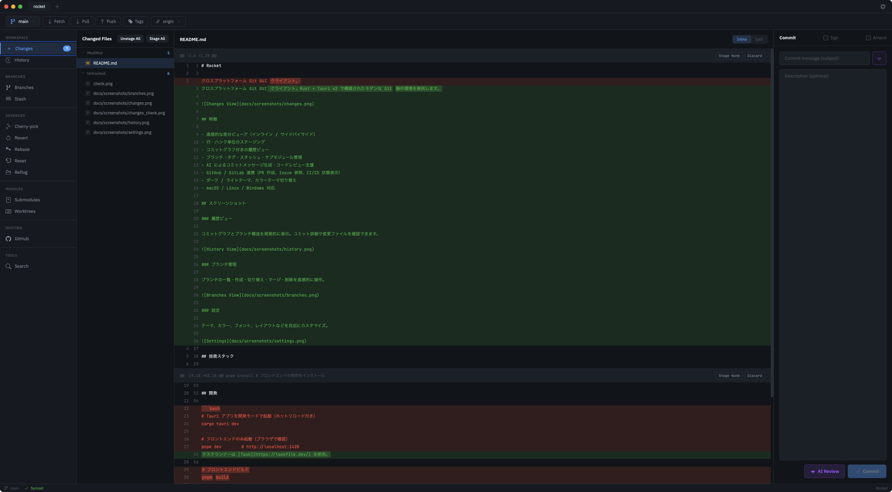
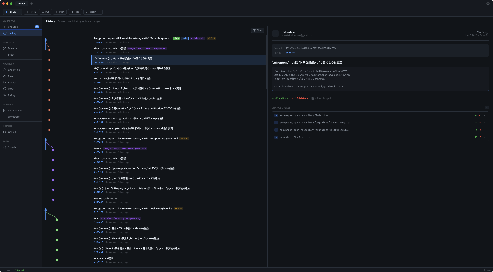
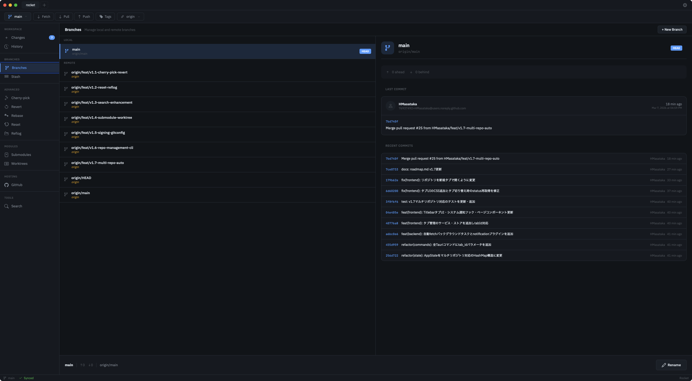

# Rocket

クロスプラットフォーム Git GUI クライアント。Rust + Tauri v2 で構築されたモダンな Git 操作環境を提供します。



## 特徴

- 直感的な差分ビューア（インライン / サイドバイサイド）
- 行・ハンク単位のステージング
- コミットグラフ付きの履歴ビュー
- ブランチ・タグ・スタッシュ・サブモジュール管理
- AI によるコミットメッセージ生成・コードレビュー支援
- GitHub / GitLab 連携（PR 作成、Issue 参照、CI/CD 状態表示）
- ダーク / ライトテーマ、カラーテーマ切り替え
- macOS / Linux / Windows 対応

## スクリーンショット

### 履歴ビュー

コミットグラフとブランチ構造を視覚的に表示。コミット詳細や変更ファイルを確認できます。



### ブランチ管理

ブランチの一覧・作成・切り替え・マージ・削除を直感的に操作。



## 技術スタック

- **バックエンド**: Rust + Tauri v2
- **フロントエンド**: React + TypeScript (Vite)
- **Git 操作**: git2-rs + git CLI ハイブリッド

## セットアップ

[Nix](https://nixos.org/) と [direnv](https://direnv.net/) が必要。

```bash
direnv allow   # 初回のみ。cargo, rustc, pnpm 等が自動で使えるようになる
pnpm install   # フロントエンドの依存をインストール
```

## 開発

タスクランナーは [Task](https://taskfile.dev/) を使用。

```bash
task dev          # Tauri アプリを開発モードで起動（ホットリロード付き）
task dev:front    # フロントエンドのみ起動（http://localhost:1420）
task build        # プロダクションビルド（バイナリ生成）
task test         # 全テスト実行（Rust + フロントエンド）
task lint         # Biome でリント・フォーマットチェック
task clippy       # Rust 静的解析
task check        # lint + clippy + test を一括実行
```

## デザインモック

`designs/` にページ単位の HTML/CSS モックアップがある。

```bash
task designs:link    # ページ遷移スクリプトを注入して designs-linked/ へ出力
task designs:clean   # 注入済みスクリプトを除去
```

## ドキュメント

- [機能仕様](docs/features.md)
- [開発ロードマップ](docs/roadmap.md)
- [デザインカバレッジ](docs/design-coverage.md)
- [ADR（技術選定記録）](docs/adr/)
